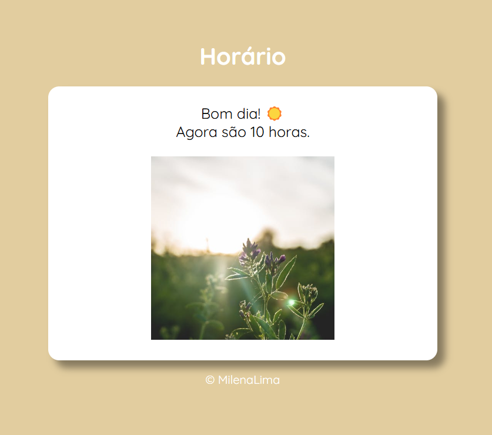
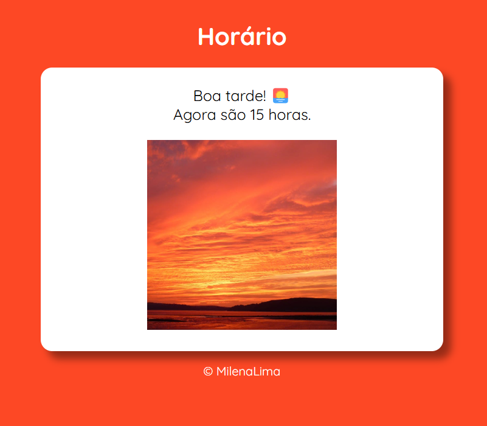
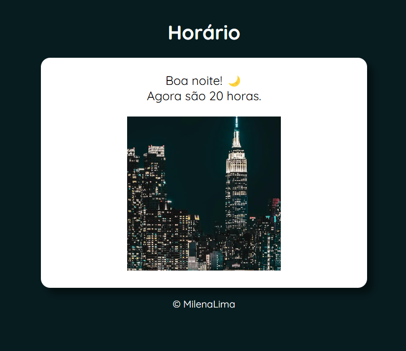

# ⏰ Horários do Dia  

Este projeto verifica o horário do computador em tempo real e exibe uma imagem correspondente para indicar se é **manhã, tarde ou noite**.  

📌 Desenvolvido como parte das aulas do **Professor Guanabara - Curso em Vídeo**.  

---

## 🎯 Funcionalidades  
✔️ Obtém o horário atual do sistema  
✔️ Exibe mensagens personalizadas conforme o período do dia  
✔️ Altera a imagem de fundo para representar **manhã, tarde ou noite**  
✔️ Interface simples e responsiva  

---

## 🚀 Tecnologias Utilizadas

- **HTML5** → Estrutura da página
- **CSS3** → Estilização e layout responsivo  
- **JavaScript** → Lógica da página

---

## 📷 Demonstração  
🔹 **Manhã** ☀️  
  

🔹 **Tarde** 🌅  
  

🔹 **Noite** 🌙  
  
